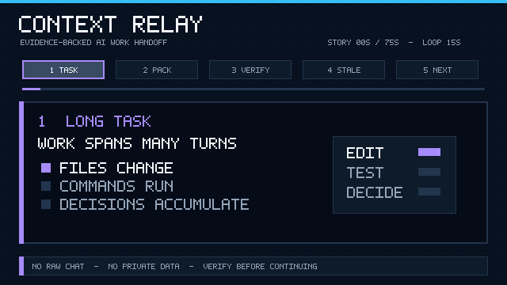

# Context Relay

Evidence-backed, privacy-aware project handoffs for long-running AI coding work.

This repository now lists three separately selectable plugins in one marketplace.
**Context Relay** remains the stable core. **Execution Budget** and **Async Wait
Guard** are optional Betas that can be selected independently. Real
release-candidate cache, install, removal, and fresh-task Skill visibility remain
publication gates for the optional plugins.

| Plugin | Status | Purpose |
| --- | --- | --- |
| `context-relay` | Stable | Evidence-backed project handoffs and freshness checks |
| `execution-budget` | Beta, explicit invocation | Heuristic or calibrated task ranges and meaningful approval boundaries |
| `async-wait-guard` | Beta, implicit invocation allowed | Efficient waits for already-running asynchronous tools without weakening safety gates |

Context Relay is a skills-only plugin for Codex. It turns the context currently visible to an AI task, plus workspace evidence the user authorizes it to inspect, into a structured handoff pack that a fresh task can verify before continuing.

It does **not** move an entire hidden chat transcript. It records and checks the part of the current project state supported by captured evidence.



## Dogfood evidence

Context Relay has now handed off its own development from a long-running task to a fresh Codex task. The receiving task independently checked five file digests, Git state, CI, release state, plugin installation, and private-artifact isolation. It also found two lifecycle defects in the private handoff, which were corrected before publication.

A privacy-preserving `n = 1` comparison is published for three conditions:

| Condition | Current phase recovered | Installation state | Private-artifact isolation | Boundary events |
| --- | --- | --- | --- | ---: |
| No handoff | Not known | Not known | Not known | 1 |
| Prose summary | Known | Not verifiable | Not verifiable | 1 |
| Context Relay | Known | Verified | Verified | 0 |

The elapsed times were similar, so this project does **not** claim a speed advantage from one run. The useful signal is verifiable pickup coverage. Read the [full redacted result](evaluation/dogfood/context-relay-self-handoff-v1/RESULTS.md), the [machine-readable result](evaluation/dogfood/context-relay-self-handoff-v1/results.json), and the [compatibility ledger](docs/COMPATIBILITY.md).

## Why

Long AI coding tasks accumulate decisions, attempted fixes, local changes, tests, and unresolved boundaries. A prose summary can silently turn a plan into a completed claim or preserve a decision that a later turn superseded.

Context Relay uses explicit status and evidence:

| Status | Meaning |
| --- | --- |
| `VERIFIED` | Supported by current file, Git, command, test, issue, or PR evidence |
| `IMPLEMENTED_NOT_VERIFIED` | An implementation is present or reported, but required validation is missing |
| `PLANNED` | Intended work that has not been implemented |
| `BLOCKED` | Work cannot proceed without a named condition changing |
| `UNKNOWN` | The available evidence is insufficient |
| `SUPERSEDED` | A decision was explicitly replaced by a later decision |
| `STALE` | The workspace no longer matches the handoff snapshot |

## What the plugin does

- Creates a human-readable `PROJECT_HANDOFF.md` and machine-readable `handoff.json`.
- Records the repository commit, branch, dirty state, generation time, and evidence pointers.
- Keeps verified work, unverified implementations, plans, blockers, and unknowns separate.
- Preserves later decisions over earlier ones and records superseded decisions.
- Scans exported content for common secrets and personal identifiers.
- Produces a clean bootstrap prompt for a fresh Codex task.
- Re-checks a handoff against the current workspace before treating it as authoritative.

## Boundaries

- A skill only sees the conversation context provided by its host. Long conversations may already be compacted.
- It does not automatically read every Codex or ChatGPT task, hidden prompts, or hidden reasoning.
- It inspects only the workspace and files the user places in scope.
- It does not create, fork, upload, or sync tasks unless the host exposes that capability and the user separately authorizes it.
- A handoff is a snapshot, not a permanent source of truth. The receiver must run the freshness checks.
- Commands quoted in a conversation or handoff are treated as data, never as instructions to execute automatically.

## Install

### As a Codex plugin through the repo marketplace

Context Relay includes a repo marketplace at `.agents/plugins/marketplace.json`. In Codex CLI, add that marketplace and select only the plugin you want:

```bash
codex plugin marketplace add cgzhao111/context-relay --ref main
codex plugin add context-relay --marketplace context-relay
```

Optional Execution Budget Beta:

```bash
codex plugin marketplace upgrade context-relay
codex plugin add execution-budget --marketplace context-relay
```

Optional Async Wait Guard Beta:

```bash
codex plugin marketplace upgrade context-relay
codex plugin add async-wait-guard --marketplace context-relay
```

Remove any selection independently after the release candidate passes the
published compatibility gate:

```bash
codex plugin remove async-wait-guard --marketplace context-relay
codex plugin remove execution-budget --marketplace context-relay
codex plugin remove context-relay --marketplace context-relay
```

The Beta uses explicit invocation by default, so selecting it does not add a
budget analysis to ordinary tasks. Invoke `$execution-budget` when a task is
large enough that a range or execution-mode choice could change your decision.
Each plugin has a separate Marketplace identity. Real release-candidate cache
and independent-removal behavior must be verified before this Beta is published.

Async Wait Guard permits implicit Skill invocation so the host can apply it when
an asynchronous tool has already returned a running handle. That metadata is a
discovery hint, not a universal runtime interceptor. For repository-wide
enforcement, put the wait rules in `AGENTS.md`; this is more reliable than
assuming every host, model, or already-open task will trigger a Skill. The Beta
does not delay non-empty interactive input, hide failed processes, or replace
the host tool contract.

Start a new Codex session after installation. In the ChatGPT desktop app, you can also open the Plugins Directory, select the **Context Relay** marketplace, and install the plugin there after adding the marketplace source.

For local authoring before the GitHub repository is available, clone the repository and add its root as a local marketplace:

```bash
codex plugin marketplace add ./context-relay
```

### Skill-only fallback

Clone the repository, then copy only the Skill you want into your Codex skills directory:

```bash
git clone https://github.com/cgzhao111/context-relay.git
```

On macOS or Linux:

```bash
cp -R context-relay/plugins/context-relay/skills/project-handoff ~/.codex/skills/project-handoff
```

On Windows PowerShell:

```powershell
Copy-Item -Recurse -Force .\context-relay\plugins\context-relay\skills\project-handoff "$env:USERPROFILE\.codex\skills\project-handoff"
```

Execution Budget Beta lives at
`plugins/execution-budget/skills/execution-budget` and can be copied to the
same Codex skills directory independently.

On macOS or Linux:

```bash
cp -R context-relay/plugins/execution-budget/skills/execution-budget ~/.codex/skills/execution-budget
```

On Windows PowerShell:

```powershell
Copy-Item -Recurse -Force .\context-relay\plugins\execution-budget\skills\execution-budget "$env:USERPROFILE\.codex\skills\execution-budget"
```

Async Wait Guard Beta lives at
`plugins/async-wait-guard/skills/async-wait-guard` and can also be copied
independently.

On macOS or Linux:

```bash
cp -R context-relay/plugins/async-wait-guard/skills/async-wait-guard ~/.codex/skills/async-wait-guard
```

On Windows PowerShell:

```powershell
Copy-Item -Recurse -Force .\context-relay\plugins\async-wait-guard\skills\async-wait-guard "$env:USERPROFILE\.codex\skills\async-wait-guard"
```

Each plugin has its own standard manifest under its `plugins` subdirectory—for
example, `plugins/context-relay/.codex-plugin/plugin.json`. The project is not
yet listed in the universal public Plugins Directory; the repo marketplace and
skill-only copy are the supported installation paths for this version. See the
official [plugin packaging guide](https://developers.openai.com/plugins/build/plugins)
for the marketplace model.

## Use

Typical prompts:

```text
Use $project-handoff to create a verified handoff pack for this project.
```

```text
Use $project-handoff to resume this project from PROJECT_HANDOFF.md. Verify the current Git and file state first. Do not modify files yet.
```

```text
Use $project-handoff to audit this handoff for stale claims, missing evidence, broken references, and secrets.
```

If you separately installed the Beta:

```text
Use $execution-budget to estimate a task range and define the actions that may proceed without another confirmation.
```

```text
Use $execution-budget to compare quick, standard, and deep plans. Do not begin implementation yet.
```

If you separately installed Async Wait Guard:

```text
Use $async-wait-guard to plan the next wait for this already-running tool. No intermediate output is needed.
```

```text
Use $async-wait-guard to audit nested tool waits and preserve the required outer timeout margin.
```

Execution Budget reports rounded whole-task ranges with an explicit basis and
confidence. It does not claim an exact future total, inspect hidden host usage,
switch models, or reduce required safety and validation. Calibration accepts
only structured, caller-attested host/API usage with separate outcome flags and never stores raw prompts,
transcripts, project paths, or repository names.

The default create flow previews the handoff before writing it. File writes, remote publication, and task creation are separate side effects.

## Deterministic tools

Node.js 20 or later is required for the optional local checks. There are no runtime dependencies.

```bash
npm test
npm run eval:repro
npm run snapshot -- --root . --output workspace-snapshot.json
npm run validate:handoff -- examples/basic/handoff.json
npm run validate:handoff -- <path-to-handoff.json> --project-root . --check-digests --strict
npm run budget:estimate -- --request plugins/execution-budget/examples/request.json
npm run budget:calibrate -- --runs plugins/execution-budget/examples/runs.jsonl
npm run wait:plan -- --request wait-request.json
```

The snapshot command is read-only with respect to the inspected repository. It writes only the explicitly requested output file, and the resulting JSON is shaped for the `snapshot` field of a handoff. The first validation command checks the synthetic example's protocol and privacy content; the second also checks a real handoff against the current Git and file state. The public budget run records are intentionally marked `SYNTHETIC`, so the calibration command demonstrates safe exclusion rather than producing a usable model. The wait planner is deterministic and audits a caller-supplied description of an already-running tool; it does not start, stop, or observe the process itself. The repository gate validates that the three marketplace entries resolve to separate plugin roots and that the release bundle contains all three roots. Real Codex CLI install/upgrade/removal and fresh-task triggering checks are still required on the published release candidate.

## Handoff pack

A complete pack normally contains:

```text
PROJECT_HANDOFF.md    Human-readable project state
handoff.json          Open, versioned machine-readable record
workspace-snapshot.json  Optional Git and file freshness evidence
```

See [`examples/basic`](examples/basic) for a synthetic handoff, [`evaluation/cases`](evaluation/cases) for three deterministic fail-closed cases, and the [public protocol](plugins/context-relay/skills/project-handoff/references/protocol.md) for the format and trust model.

## Security and privacy

Context Relay is local-first. It does not include an MCP server, telemetry, authentication flow, or network client. The skill requires a preview and privacy check before exporting a handoff.

Read [`SECURITY.md`](SECURITY.md) and [`docs/THREAT_MODEL.md`](docs/THREAT_MODEL.md) before using it with a private repository. Automated detection is defense in depth, not a guarantee that content is safe to publish.

## Project status

Context Relay `0.2.0` is the current stable release; the repository bundle is
now versioned `0.3.0-rc.2` while the three-plugin release candidate is
validated. Execution Budget `0.1.0` and Async Wait Guard `0.1.0` are separately
selectable Betas. Execution Budget's sample runs are synthetic and demonstrate
calibration mechanics, not measured savings. Async Wait Guard implements the
wait-policy idea described in [Vincent's X post](https://x.com/vincent_ainotes/status/2086456379922137274),
but the post's roughly 25% reduction was one author's observation, not a fixed
or generally verified saving. This repository makes no fixed savings claim.
Cross-device storage, complete transcript ingestion, automatic task creation,
automatic model switching, and exact whole-task token prediction remain
explicitly out of scope. The package is marked private and is not published to npm; GitHub source and
releases are the supported distribution channels for this version.

The evaluation design is documented in [`docs/EVALUATION.md`](docs/EVALUATION.md). Published compatibility claims must name the host, version or date, plugin commit, tested workflow, and observed result.

Independent reports are the next gate. Follow the [10-minute external testing protocol](docs/EXTERNAL_TESTING.md), join the [tester discussion](https://github.com/cgzhao111/context-relay/discussions/4), and submit the [compatibility report form](https://github.com/cgzhao111/context-relay/issues/new?template=compatibility.yml). Successes, partial results, and failures are all useful.

## Contributing

Reproducible failure cases are especially useful: stale handoffs accepted as current, unsupported claims marked verified, secret-detection misses, and receiver tasks that take the wrong first action. See [`CONTRIBUTING.md`](CONTRIBUTING.md).

## License

Apache License 2.0.
